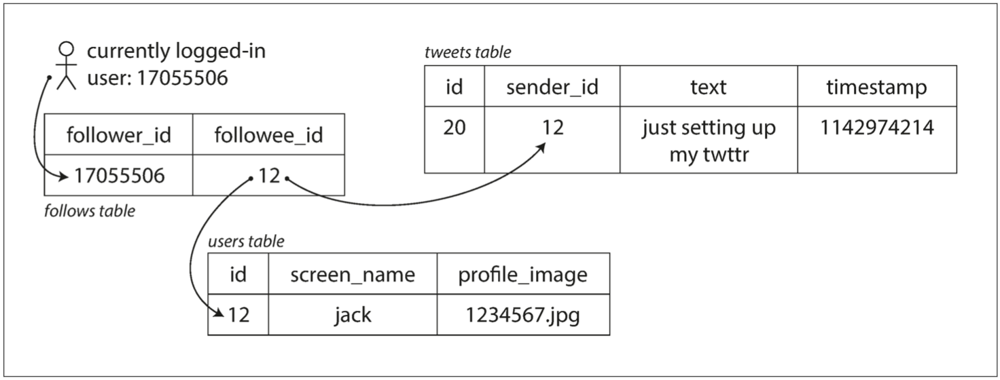
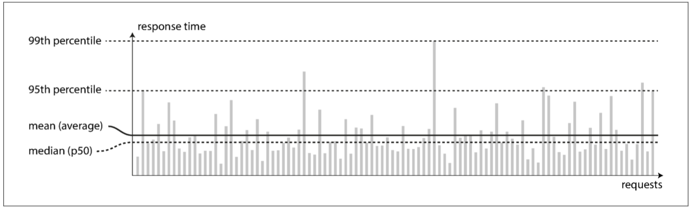

# CHAPTER 1: Reliable, Scalable, and Maintainable Applications

## 1 Thinking About Data Systems

For  example,  if  you  have  an  application-managed  caching  layer  (using  Memcached or  similar),  or  a  full-text  search  server  (such  as  Elasticsearch  or  Solr)  separate  from your main database, it is normally the application code’s responsibility to keep those caches and indexes in sync with the main database.

_Figure 1-1. One possible architecture for a data system that combines several components._

## 2 Reliability

### 2.1 Hardware Faults

### 2.2 Software Errors

### 2.3 Human Errors

### 2.4 How Important Is Reliability?

## 3 Scalability

### 3.1 Describing Load

_load  parameters_

To  make  this  idea  more  concrete,  let’s  consider  Twitter  as  an  example,  using  datapublished in November 2012 [16]. Two of Twitter’s main operations are:

1. _Post tweet_: A  user  can  publish  a  new  message  to  their  followers
    (4.6k  requests/sec  on  aver‐age, over 12k requests/sec at peak).
2. _Home timeline_: A user can view tweets posted by the people they follow
    (300k requests/sec).

Simply handling 12,000 writes per second (the peak rate for posting tweets) would befairly easy. However, Twitter’s scaling challenge is not primarily due to tweet volume, but  due  to  _fan-out_ ii —each  user  follows  many  people,  and  each  user  is  followed  by many people.

ii. A term borrowed from electronic engineering, where it describes the number of logic gate inputs that areattached to another gate’s output. The output needs to supply enough current to drive all the attached inputs. In transaction processing systems, we use it to describe the number of requests to other services that we needto make in order to serve one incoming request.

There are broadly two ways of implementing these two operations:

1. _Figure 1-2. Simple relational schema for implementing a Twitter home timeline._
    

2. _Figure 1-3. Twitter’s data pipeline for delivering tweets to followers, with load parame‐ters as of November 2012 [16]._
    

The  first  version  of  Twitter  used  approach  1,  but  the  systems  struggled  to  keep  upwith the load of home timeline queries, so the company switched to approach 2.

The final twist of the Twitter anecdote: now that approach 2 is robustly implemented,Twitter is moving to a hybrid of both approaches. ... Tweets from any celebrities that a user may follow are fetched separately and merged with that user’s home timeline when it is read, like in approach 1.

### 3.2 Describing Performance

_Figure 1-4. Illustrating mean and percentiles: response times for a sample of 100requests to a service._

_p50_ _p95_ _p99_ _p999_

_Figure 1-5. When several backend calls are needed to serve a request, it takes just a sin‐gle slow backend request to slow down the entire end-user request._

### 3.3 Approaches for Coping with Load

## 4 Maintainability

### 4.1 Operability: Making Life Easy for Operations

### 4.2 Simplicity: Managing Complexity

### 4.3 Evolvability: Making Change Easy

## Summary

_functional  requirements_ and _nonfunctional require‐ments_

- _Reliability_
- _Scalability_
- _Maintainability_
