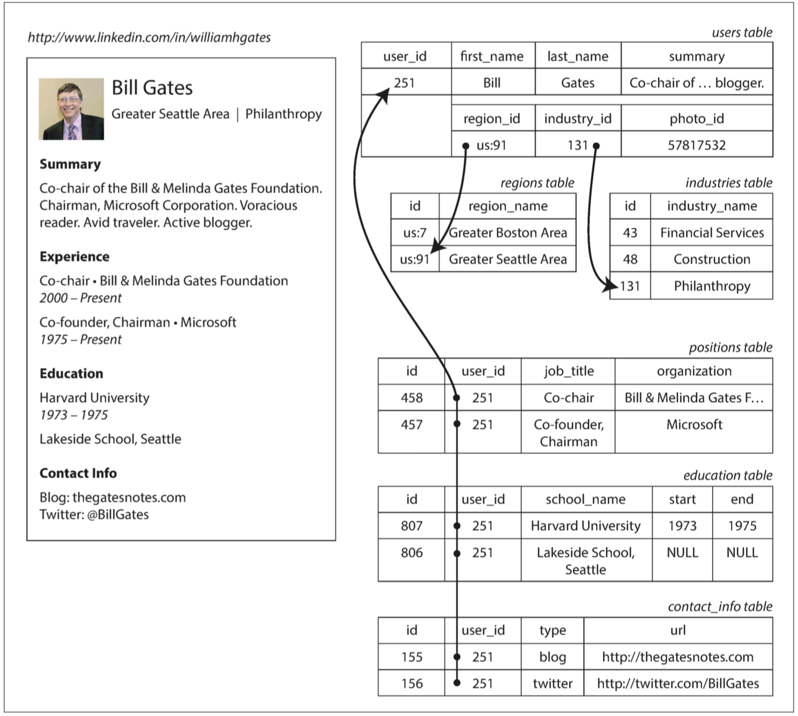
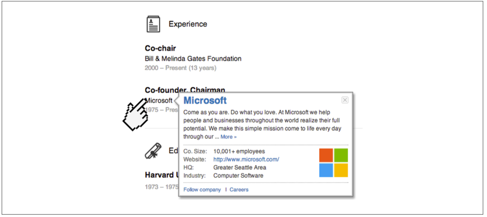
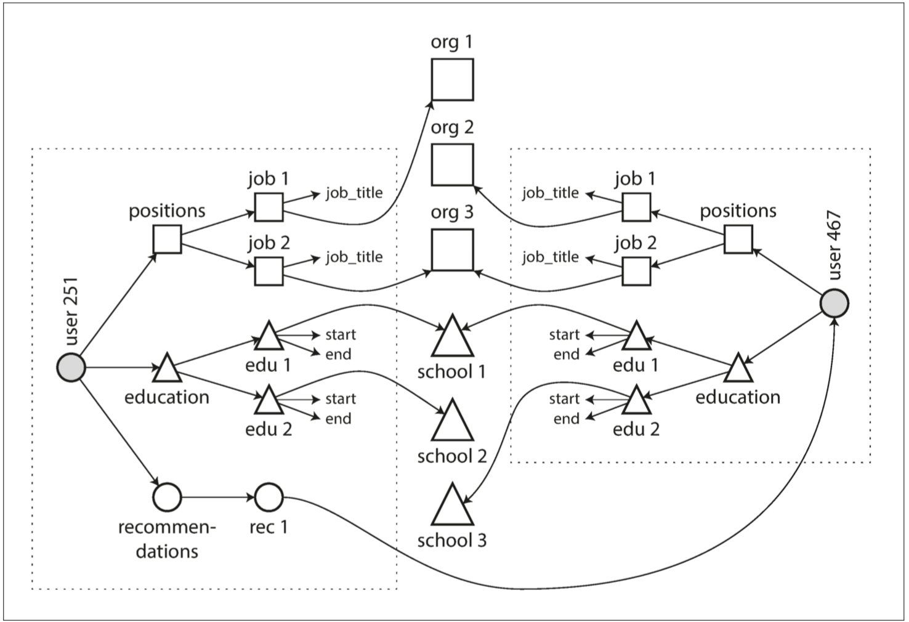
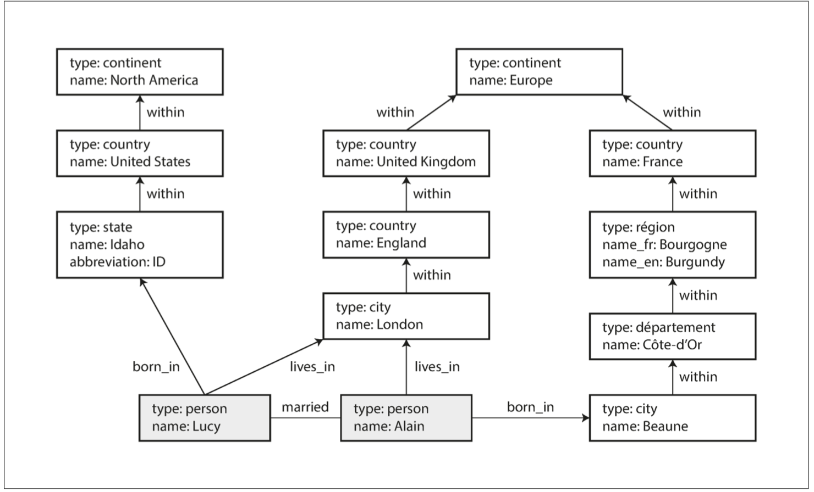

# CHAPTER 2: Data Models and Query Languages

## 1 Relational Model Versus Document Model

### 1.1 The Birth of NoSQL

### 1.2 The Object-Relational Mismatch

_Figure 2-1. Representing a LinkedIn profile using a relational schema. Photo of Bill Gates courtesy of Wikimedia Commons, Ricardo Stuckert, Agência Brasil._

_Figure 2-2. One-to-many relationships forming a tree structure._

### 1.3 Many-to-One and Many-to-Many Relationships

_Figure 2-3. The company name is not just a string, but a link to a company entity. Screenshot of linkedin.com._

_Figure 2-4. Extending résumés with many-to-many relationships._

### 1.4 Are Document Databases Repeating History?

_Figure 2-5. Example of graph-structured data (boxes represent vertices, arrows repre‐sent edges)._

### 1.5 Relational Versus Document Databases Today

## 2 Query Languages for Data

### 2.1 Declarative Queries on the Web

### 2.2 MapReduce Querying

## 3 Graph-Like Data Models

### 3.1 Property Graphs

### 3.2 The Cypher Query Language

### 3.3 Graph Queries in SQL

### 3.4 Triple-Stores and SPARQL

### 3.5 The Foundation: Datalog

_Datalog_  is  a  much  older  language  than  SPARQL  or  Cypher,  having  been  studied extensively  by  academics  in  the  1980s  [44,  45,  46].

_Figure 2-6. Determining that Idaho is in North America, using the Datalog rules from Example 2-11._

## Summary
