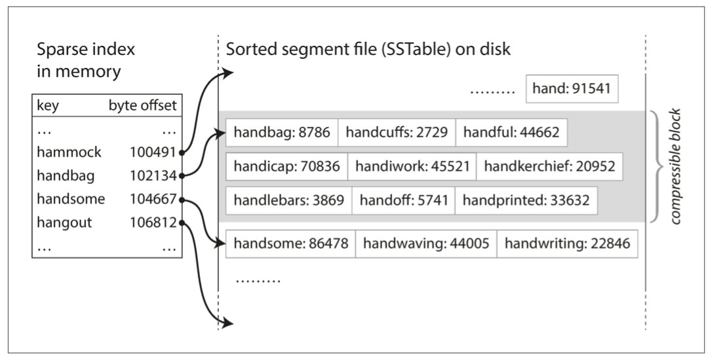

# CHAPTER 3: Storage and Retrieval

## 1 Data Structures That Power Your Database

### 1.1 Hash Indexes

假设我们的数据存储只包括对文件的追加，就像前面的例子一样。 那么最简单的索引策略就是：保留一个内存中的哈希映射，每个键都被映射到数据文件中的一个字节偏移量--可以找到该值的位置，如图3-1所示。 每当你在文件中添加一个新的键值对时，你也要更新哈希映射以反映你刚写的数据的偏移量（这对插入新的键和更新现有的键都一样）。 当你想查找一个值时，使用哈希图找到数据文件中的偏移量，寻找到该位置，并读取该值。

_Figure 3-1. Storing a log of key-value pairs in a CSV-like format, indexed with an in-memory hash map._

事实上，这基本上就是Bitcask（Riak的默认存储引擎）的工作[3]。Bitcask提供了高性能的读写，但前提是所有的键都要放入可用的RAM，因为哈希图是完全保存在内存中的。 值可以使用比可用内存更多的空间，因为它们可以从磁盘加载，只需一次磁盘寻址。 如果数据文件的那一部分已经在文件系统的缓存中，读取时根本不需要任何磁盘I/O。

_compaction_

_Figure 3-2. Compaction of a key-value update log (counting the number of times eachcat video was played), retaining only the most recent value for each key._

_Figure 3-3. Performing compaction and segment merging simultaneously._

简而言之，在实际实现中，一些重要的问题是:

1. _File format_: CSV并不是日志的最佳格式。使用二进制格式更快、更简单，它首先以字节为单位对字符串的长度进行编码，然后是原始字符串（不需要转义）。
2. _Deleting records_: _tombstone_
3. _Crash recovery_: 如果数据库被重新启动，内存中的哈希映射就会丢失。
    原则上，你可以通过从头到尾阅读整个段文件，并在阅读过程中注意每个键的最新值的偏移量来恢复每个段的哈希图。然而，如果段文件很大，这可能需要很长的时间，这将使服务器重新启动变得很痛苦。
    Bitcask通过在磁盘上存储每个段的哈希图的快照来加快恢复速度，这可以更快地加载到内存。
4. _Partially written records_: 数据库可能在任何时候崩溃，包括在向日志添加记录的途中。
    Bitcask文件包括校验和，允许检测和忽略日志中这种损坏的部分。
5. _Concurrency control_: 由于写入是以严格的顺序追加到日志中的，一个常见的实现选择是只有一个写入线程。
    数据文件段是 append-only ，其他方面是 immutable ，所以它们可以被多个线程并发地读取。

Append-only 日志乍一看似乎很浪费：为什么不在原地更新文件，用新的值覆盖旧的值？但是，由于几个原因，只做追加的设计被证明是好的：
1. 附加和分段合并是连续的写操作，通常比随机写快得多，特别是在磁性旋转硬盘上。 在某种程度上，顺序写操作在基于闪存的固态硬盘（SSD）上也是比较好的[4]。我们将在第83页的 "比较B树和LSM树 "中进一步讨论这个问题。
2. 如果段文件是只附加的或不可变的，那么并发和崩溃恢复就简单多了。例如，你不必担心当一个值被覆盖时发生崩溃，留下一个包含部分旧值和部分新值拼接的文件。
3. 合并旧的片段，可以避免数据文件因时间推移而变得支离破碎的问题。

然而，哈希表的索引也有限制。
1. 哈希表必须装在内存中，所以如果你有非常多的键，你就没戏了。 
    原则上，你可以在磁盘上维护一个哈希图，但不幸的是，要使一个磁盘上的哈希图表现良好是很困难的。 它需要大量的随机访问I/O，当它变满的时候，它的增长是很昂贵的，而且哈希碰撞需要复杂的逻辑[5]。
3. 范围查询并不高效。例如，你不能轻易扫描kitty00000和kitty99999之间的所有键--你必须在哈希图中单独查找每个键。

### 1.2 SSTables and LSM-Trees

_sorted by key_

_Sorted String Table_, _SSTable_

1. 合并片段是简单而有效的，即使文件比可用的内存大。

    

    _Figure 3-4. Merging several SSTable segments, retaining only the most recent valuefor each key._

    如果同一个键出现在几个输入段中怎么办？ 请记住，每个段都包含了某段时间内写入数据库的所有值。 这意味着一个输入段中的所有值必须比另一个段中的所有值更新（假设我们总是合并相邻的段）。当多个段包含相同的键时，我们可以保留最近的段中的值，而丢弃较早的段中的值。

2. 为了在文件中找到某个特定的键，你不再需要在内存中保留所有键的索引。

    

    _Figure 3-5. An SSTable with an in-memory index._

3. 

#### 1.2.1 Constructing and maintaining SSTables

现在我们可以让我们的存储引擎按如下方式工作：
1. 当一个写进来的时候，把它添加到一个内存中的平衡树数据结构（例如，一个红黑树）。这个内存中的树有时被称为memtable。
2. 当memtable大于某个阈值时--通常是几兆字节--将其作为SSTable文件写到磁盘上。这可以有效地完成，因为树已经维护了按键排序的键值对。 新的SSTable文件成为数据库的最新部分。 当SSTable被写到磁盘上时，可以继续写到一个新的memtable实例。
3. 为了满足一个读取请求，首先尝试在memtable中找到键，然后在最近的磁盘段中，然后在下一个较旧的段中，等等。
4. 不时地在后台运行一个合并和压缩过程，以合并段文件并丢弃被覆盖或删除的值。

这个方案工作得非常好。 它只存在一个问题：如果数据库崩溃，最近的写操作（在memtable中但还没有写到磁盘上）就会丢失。 为了避免这个问题，我们可以在磁盘上保留一个单独的日志，每一次写入都会被立即追加，就像上一节所说的。该日志不是按排序的，但这并不重要，因为它的唯一目的是在崩溃后恢复内存表。每当memtable被写入SSTable时，相应的日志就可以被丢弃了。

#### 1.2.2 Making an LSM-tree out of SSTables

这里描述的算法基本上是LevelDB[6]和RocksDB[7]中使用的，这两个键值存储引擎库被设计成可以嵌入到其他应用程序。 在其他方面，LevelDB可以在Riak中作为Bitcask的替代品。Cassandra和HBase[8]中也使用了类似的存储引擎，它们都是受Google的Bigtable论文[9]（引入了SSTable和memtable这两个术语）的启发。

Lucene是Elasticsearch和Solr使用的用于全文搜索的索引引擎，它使用类似的方法来存储其术语字典[ 12, 13]。全文索引比键值索引要复杂得多，但它基于一个类似的想法：在搜索查询中给定一个词，找到所有提到这个词的文档（网页、产品描述等）。这是用一个键值结构实现的，其中键是一个词（术语），值是所有包含这个词的文档的ID列表（发布列表）。在Lucene中，这个从词到张贴列表的映射被保存在类似SSTable的分类文件中，这些文件在后台根据需要进行合并[14]。

#### 1.2.3 Performance optimizations

例如，LSM树算法在查找数据库中不存在的键时可能会很慢：你必须先检查memtable，然后再检查段，一直到最古老的段（可能每段都要从磁盘读取），然后才能确定该键不存在。 为了优化这种访问，存储引擎经常使用额外的 Bloom 过滤器[15]。（布隆过滤器是一种内存效率高的数据结构，用于近似计算一个集合的内容。它可以告诉你，如果一个键不在数据库中出现，从而节省了许多不存在的键的不必要的磁盘读取）

也有不同的策略来决定SST表压实和合并的顺序和时间。 最常见的选项是 _size-tiered_ and _leveled_ compaction
- 在 size-tiered com‐paction, 较新和较小的 SSTables 被连续地合并到较老和较大的 SSTables 。 
- 在 leveled compaction 中， key 范围被分割成更小的SST表，而较旧的数据被移到单独的 "层次 "中，这使得压缩可以更渐进地进行并使用更少的磁盘空间。

LevelDB和RocksDB使用分级压实（因此被称为LevelDB），HBase使用大小分层，而Cassandra同时支持这两种方式[16]。

### 1.3 B-Trees

_Figure 3-6. Looking up a key using a B-tree index._

在B树的一个页面中对子页面的引用数量被称为 _分支因子_ 。 例如，在图3-6中，分支因子是6。 在实践中，分支因子取决于存储页面引用和范围边界所需的空间量，但通常是几百。

_Figure 3-7. Growing a B-tree by splitting a page._

这种算法保证了树的 _平衡_ ：一个有n个键的B树的深度总是O(log n)。大多数数据库可以装入一个三或四级深度的B树，所以你不需要跟随许多页面参考来找到你要找的页面。一个由4KB页面组成的四级树，分支系数为500，可以存储256TB。

#### 1.3.1 Making B-trees reliable

_write-ahead log_ (WAL, _redo log_)

数据唯一，并发写要加锁

#### 1.3.2 B-tree optimizations

1. CoW MVCC
2. We  can  save  space  in  pages  by  not  storing  the  entire  key,  but  abbreviating  it. Higher branching factor, fewer levels.
3. 维护磁盘上的全局顺序，很难 LSM树利好范围查询

### 1.4 Comparing B-Trees and LSM-Trees

（一般）LSM树写入快，B树读取快

LSM树读取要一个个找

#### 1.4.1 Advantages of LSM-trees

B树写入先要写日志，再写树，写树是整个页覆盖，还可能会分页，即要写新的页

LSM树的写开销是压缩&合并及写索引，写放大较小

机械盘，LSM树是顺序写入，比随机写入快

LSM树占用空间更小，B树是整页的，会有碎片

#### 1.4.2 Downsides of LSM-trees

不确定性，后台压缩合并干扰读写，压缩合并跟不上写入，磁盘会耗尽，读取要找很多个文件。

B树的数据没有副本，方便加锁

### 1.5 Other Indexing Structures

_primary key_ index

_secondary  indexes_

#### 1.5.1 Storing values within the index

_heap file_

_clustered index_. 例如，在MySQL的InnoDB存储引擎中，表的主键总是一个聚类索引， secondary indexes 引用的是主键（而不是一个堆文件位置）[31]。在SQL Server中，你可以为每个表指定一个聚类索引[32]。

在聚类索引（在索引中存储所有的行数据）和非聚类索引（在索引中只存储对数据的引用）之间的一个折衷，被称为 _覆盖索引_ 或 _包含列的索引_ ，它在索引中存储了一个表的一些列[33]。 这使得一些查询可以通过单独使用索引来回答（在这种情况下，索引被称为 _cover_ 查询）[32]。

#### 1.5.2 Multi-column indexes

_concatenated index_ 电话簿

_Multi-dimensional indexes_ 地理 R树

#### 1.5.3 Full-text search and fuzzy indexes

#### 1.5.4 Keeping everything in memory

## 2 Transaction Processing or Analytics?

### 2.1 Data Warehousing

_Figure 3-8. Simplified outline of ETL into a data warehouse._

### 2.2 Stars and Snowflakes: Schemas for Analytics

_Figure 3-9. Example of a star schema for use in a data warehouse._

## 3 Column-Oriented Storage

_Figure 3-10. Storing relational data by column, rather than by row._

### 3.1 Column Compression

_Figure 3-11. Compressed, bitmap-indexed storage of a single column._

### 3.2 Sort Order in Column Storage

### 3.3 Writing to Column-Oriented Storage

### 3.4 Aggregation: Data Cubes and Materialized Views

_Figure 3-12. Two dimensions of a data cube, aggregating data by summing._

## Summary
