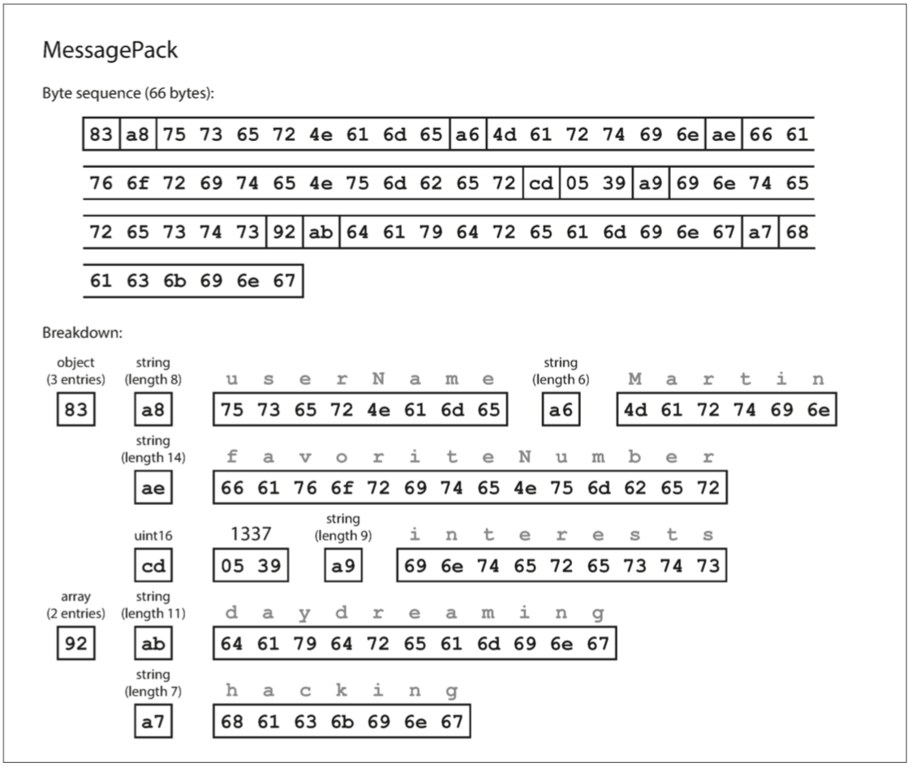
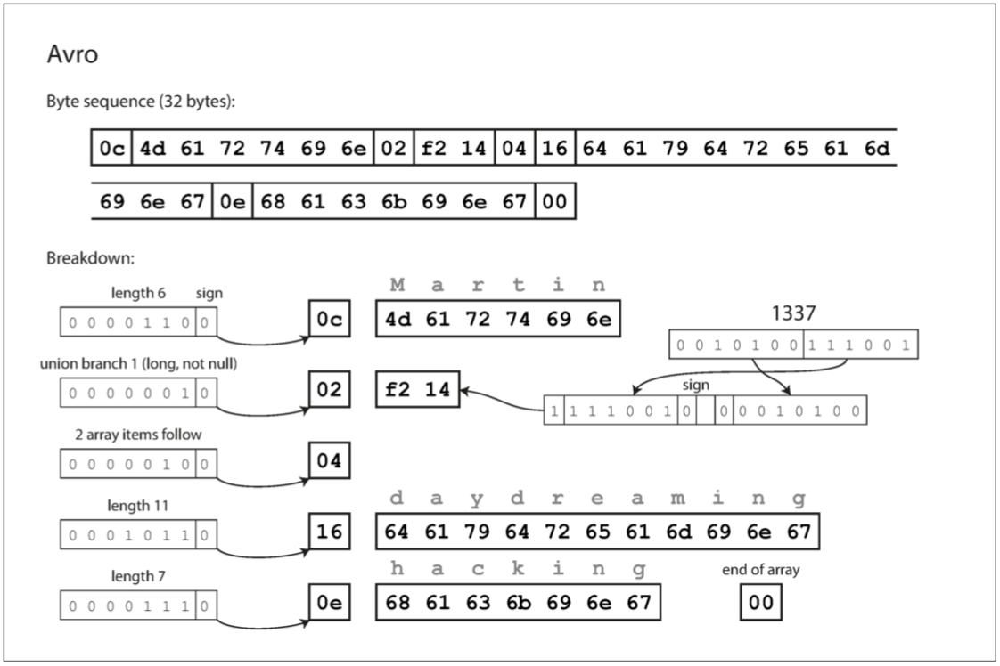
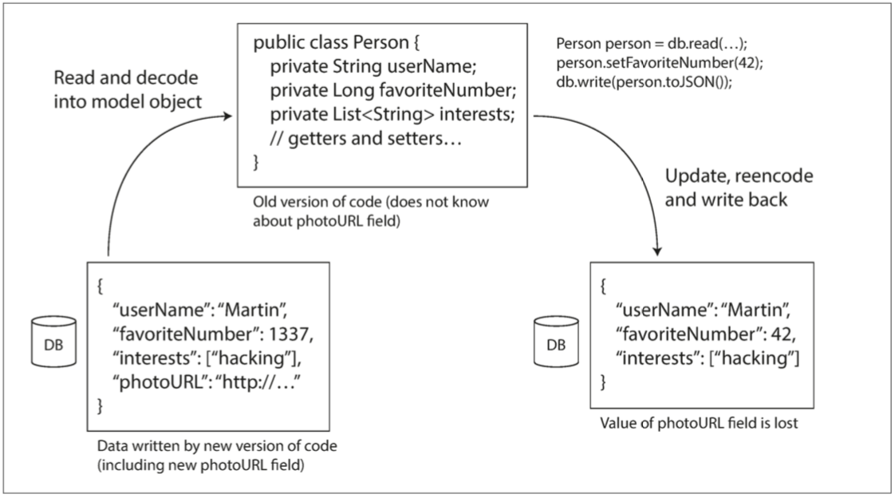

# CHAPTER 4: Encoding and Evolution

## 1 Formats for Encoding Data

### 1.1 Language-Specific Formats

### 1.2 JSON, XML, and Binary Variants

_Figure 4-1. Example record (Example 4-1) encoded using MessagePack._

### 1.3 Thrift and Protocol Buffers

_Figure 4-2. Example record encoded using Thrift’s BinaryProtocol._

_Figure 4-3. Example record encoded using Thrift’s CompactProtocol._

_Figure 4-4. Example record encoded using Protocol Buffers._

### 1.4 Avro

_Figure 4-5. Example record encoded using Avro._

_Figure 4-6. An Avro reader resolves differences between the writer’s schema and the reader’s schema._

### 1.5 The Merits of Schemas

## 2 Modes of Dataflow

### 2.1 Dataflow Through Databases

_Figure 4-7. When an older version of the application updates data previously written by a newer version of the application, data may be lost if you’re not careful._

### 2.2 Dataflow Through Services: REST and RPC

### 2.3 Message-Passing Dataflow

## Summary
