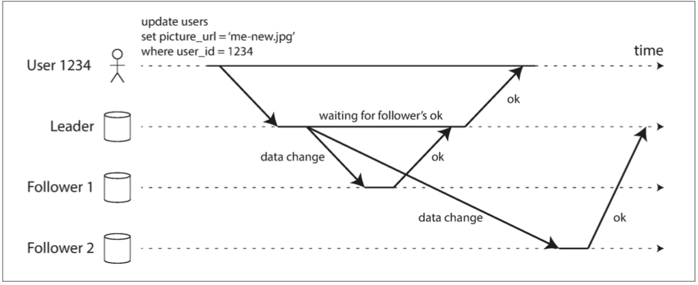
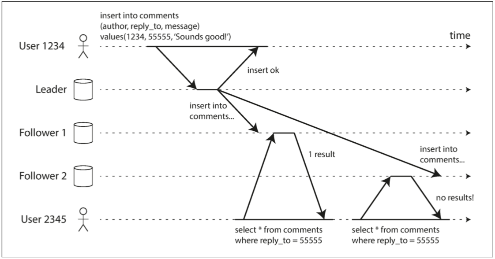

# CHAPTER 5: Replication

## 1 Leaders and Followers

_replica_

_leader-based replication_ (_active/passive_ or _master–slave replication_)

_Figure 5-1. Leader-based (master–slave) replication._

### 1.1 Synchronous Versus Asynchronous Replication

_Figure 5-2. Leader-based replication with one synchronous and one asynchronous follower._

### 1.2 Setting Up New Followers

### 1.3 Handling Node Outages

### 1.4 Implementation of Replication Logs

## 2 Problems with Replication Lag

### 2.1 Reading Your Own Writes 读己之写

_Figure 5-3. A user makes a write, followed by a read from a stale replica. To prevent this anomaly, we need read-after-write consistency._

### 2.2 Monotonic Reads

_Figure 5-4. A user first reads from a fresh replica, then from a stale replica. Time appears to go backward. To prevent this anomaly, we need monotonic reads._

### 2.3 Consistent Prefix Reads

_Figure 5-5. If some partitions are replicated slower than others, an observer may see the answer before they see the question._

### 2.4 Solutions for Replication Lag

## 3 Multi-Leader Replication

### 3.1 Use Cases for Multi-Leader Replication

_Figure 5-6. Multi-leader replication across multiple datacenters._

### 3.2 Handling Write Conflicts

_Figure 5-7. A write conflict caused by two leaders concurrently updating the same record._

### 3.3 Multi-Leader Replication Topologies

_Figure 5-8. Three example topologies in which multi-leader replication can be set up._

_Figure 5-9. With multi-leader replication, writes may arrive in the wrong order at some replicas._

## 4 Leaderless Replication

### 4.1 Writing to the Database When a Node Is Down

_Figure 5-10. A quorum write, quorum read, and read repair after a node outage._

Quorum 条件, w + r > n,
- 如果 n = 3，w = 2，r = 2，我们可以容忍一个不可用的节点。
- 如果 n = 5，w = 3，r = 3，我们可以容忍两个不可用的节点。这种情况如图5-11所示。

    

    _Figure 5-11. If w + r > n, at least one of the r replicas you read from must have seen the most recent successful write._

- 通常情况下，读和写总是被平行地发送到所有n个副本。 参数w和r决定了我们要等待多少个节点--即n个节点中需要有多少个报告成功，我们才能认为读或写是成功的。

### 4.2 Limitations of Quorum Consistency

### 4.3 Sloppy Quorums and Hinted Handoff

### 4.4 Detecting Concurrent Writes

_Figure 5-12. Concurrent writes in a Dynamo-style datastore: there is no well-defined ordering._

_Figure 5-13. Capturing causal dependencies between two clients concurrently editing a shopping cart._

_Figure 5-14. Graph of causal dependencies in Figure 5-13._

## Summary
