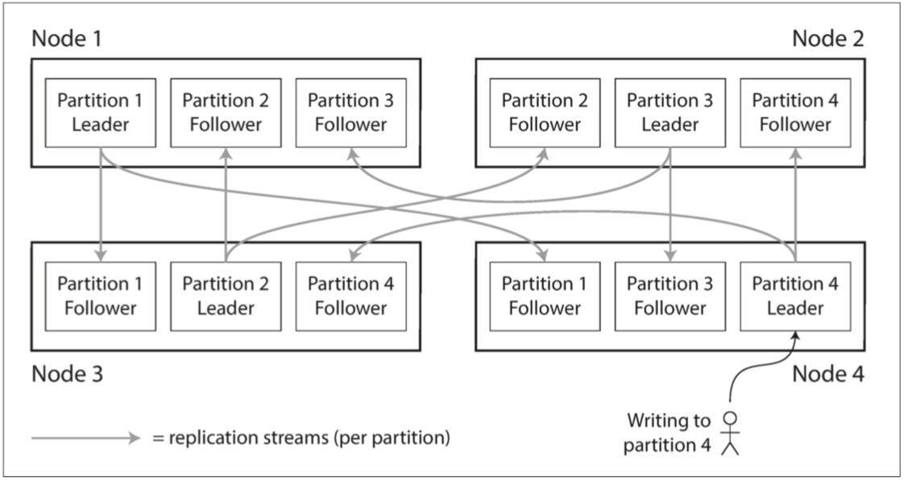
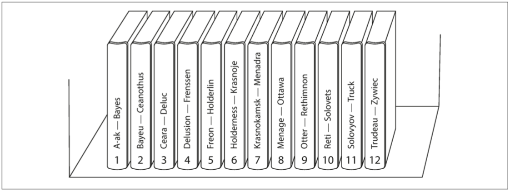
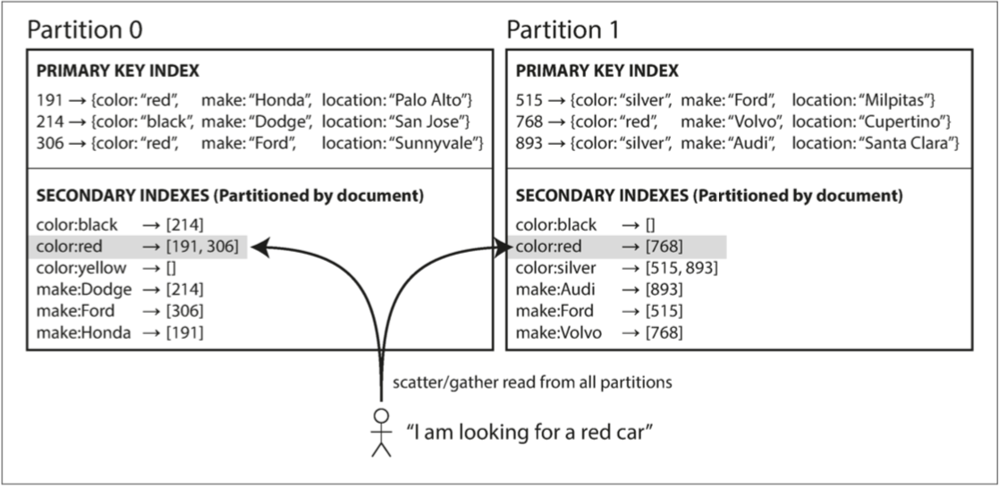

# CHAPTER 6: Partitioning

## 1 Partitioning and Replication

_Figure 6-1. Combining replication and partitioning: each node acts as leader for somepartitions and follower for other partitions._

## 2 Partitioning of Key-Value Data

_skewed_

_hot spot_

### 2.1 Partitioning by Key Range

_Figure 6-2. A print encyclopedia is partitioned by key range._

Bigtable、其开源 equivalent HBase[2, 3]、RethinkDB以及2.4版之前的MongoDB[4]都采用了这种分区策略。

__[`id`+`time`]__ 例如，你可以在每个时间戳前加上传感器的名字，这样就会先按传感器的名字分区，然后再按时间分区。 假设你有许多传感器同时处于活动状态，写负载最终将更均匀地分布在各分区上。 现在，当你想在一个时间范围内获取多个传感器的值时，你需要为每个传感器名称执行一个单独的范围查询。

### 2.2 Partitioning by Hash of Key

_Figure 6-3. Partitioning by hash of key._

_consistent hashing_

__[`hash`+`range`]__ Cassandra实现了这两种分区策略的折中[11,12,13]。Cassandra中的一个表可以用一个由几列组成的复合主键来声明。 只有该键的第一部分被散列以确定分区，但其他列被用作Cassandra的SSTables中数据排序的连接索引。 因此，查询不能在复合键的第一列中搜索数值范围，但如果它为第一列指定了一个固定的数值，它就可以对键的其他列进行有效的范围扫描。

连接索引的方法为一对多的关系提供了一个优雅的数据模型。

__[`id`+`time`]__ 例如，在一个社交媒体网站上，一个用户可能会发布许多更新。如果更新的主键被选择为（user_id，update_timestamp），那么你可以有效地检索一个特定用户在某个时间间隔内的所有更新，并按时间戳排序。 不同的用户可以存储在不同的分区上，但在每个用户中，更新是按时间戳顺序存储在一个分区上。

__[`key_xx`]__ 例如，如果已知一个key热度很高，一个简单的技术是在key的开头或结尾添加一个随机数。仅仅是一个两位数的十进制随机数就可以把对key的写入量平均分配到100个不同的key上，使这些key可以被分配到不同的分区。

__[读放大]__ 然而，在不同的键上分割写入后，任何读取都必须做额外的工作，因为他们必须从所有100个键上读取数据并将其合并。

这种技术还需要额外的簿记：只对少数热键追加随机数是有意义的；对于绝大多数写量低的键，这将是不必要的开销。因此，你还需要用某种方式来跟踪哪些键被分割。

### 2.3 Skewed Workloads and Relieving Hot Spots

## 3 Partitioning and Secondary Indexes

### 3.1 Partitioning Secondary Indexes by Document (读放大)

_Figure 6-4. Partitioning secondary indexes by document._

这种查询分区数据库的方法有时被称为 "_分散_/_聚集_"，它可以使对二级索引的读取查询相当昂贵。 即使你以并行方式查询分区，散点/聚点也很容易出现尾部延迟放大的情况（见第16页的 "实践中的百分比"）。

尽管如此，它还是被广泛使用。 MongoDB、Riak[15]、Cassandra[16]、Elasticsearch[17]、SolrCloud[18]和VoltDB[19]都使用文档分区的二级索引。大多数数据库供应商建议你构建你的分区方案，以便二级索引查询可以从一个分区中得到服务，但这并不总是可能的，特别是当你在一个查询中使用多个二级索引的时候（比如同时按颜色和按品牌过滤汽车）。

### 3.2 Partitioning Secondary Indexes by Term

_Figure 6-5. Partitioning secondary indexes by term._

__[写放大]__ 然而，全局索引的缺点是写入速度更慢，更复杂，因为现在对一个文件的写入可能会影响到索引的多个分区（文件中的每个术语可能在不同的分区上，在不同的节点上）。

在实践中，对全局二级索引的更新往往是异步的（也就是说，如果你在写完后不久就读取索引，那么你刚才的改变可能还没有反映在索引中）。例如，Amazon DynamoDB表示，在正常情况下，其全局二级索引的更新时间为几分之一秒，但在基础设施出现故障的情况下，可能会出现较长的传播延迟[20]。

## 4 Rebalancing Partitions

### 4.1 Strategies for Rebalancing

_Figure 6-6. Adding a new node to a database cluster with multiple partitions per node._

### 4.2 Operations: Automatic or Manual Rebalancing

重新平衡是一个代价高昂的操作，因为它需要重新分配请求并将大量的数据从一个节点转移到另一个节点。如果不小心操作，这个过程可能会使网络或节点过载，并在重新平衡的过程中损害其他请求的性能。

这种自动化在与自动故障检测相结合时可能是危险的。例如，假设一个节点过载，对请求的反应暂时缓慢。其他节点认为过载的节点已经死亡，并自动重新平衡集群，将负载从它身上移开。这给过载的节点、其他节点和网络带来了额外的负载，使情况变得更糟，并有可能导致级联故障。

## 5 Request Routing

_Figure 6-7. Three different ways of routing a request to the right node._

_Figure 6-8. Using ZooKeeper to keep track of assignment of partitions to nodes._

### 5.1 Parallel Query Execution

## Summary
