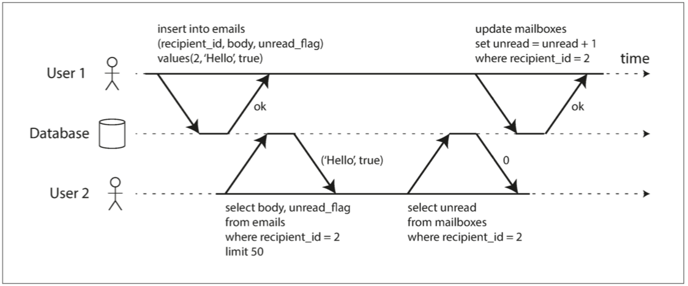
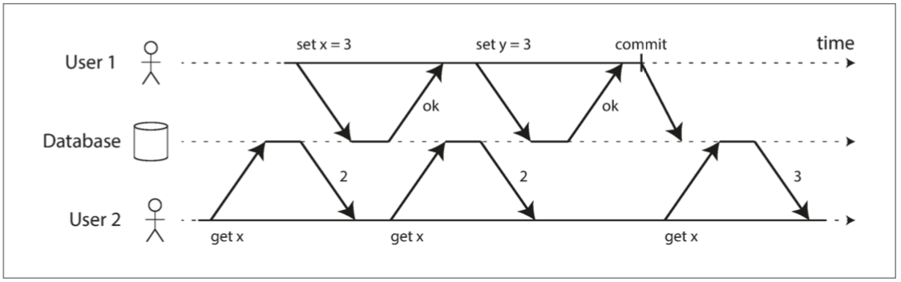

# CHAPTER 7: Transactions

## 1 The Slippery Concept of a Transaction

_Figure 7-1. A race condition between two clients concurrently incrementing a counter._

### 1.1 The Meaning of ACID

### 1.2 Single-Object and Multi-Object Operations

_Figure 7-2. Violating isolation: one transaction reads another transaction’s uncommitted writes (a “dirty read”)._

_Figure 7-3. Atomicity ensures that if an error occurs any prior writes from that transaction are undone, to avoid an inconsistent state._

## 2 Weak Isolation Levels

### 2.1 Read Committed

_Figure 7-4. No dirty reads: user 2 sees the new value for x only after user 1’s transaction has committed._

_Figure 7-5. With dirty writes, conflicting writes from different transactions can be mixed up._

### 2.2 Snapshot Isolation and Repeatable Read

_Figure 7-6. Read skew: Alice observes the database in an inconsistent state._

_Figure 7-7. Implementing snapshot isolation using multi-version objects._

### 2.3 Preventing Lost Updates

### 2.4 Write Skew and Phantoms

_Figure 7-8. Example of write skew causing an application bug._

## 3 Serializability

### 3.1 Actual Serial Execution

_Figure 7-9. The difference between an interactive transaction and a stored procedure (using the example transaction of Figure 7-8)._

### 3.2 Two-Phase Locking (2PL)

### 3.3 Serializable Snapshot Isolation (SSI)

_Figure 7-10. Detecting when a transaction reads outdated values from an MVCC snapshot._

_Figure 7-11. In serializable snapshot isolation, detecting when one transaction modifies another transaction’s reads._
