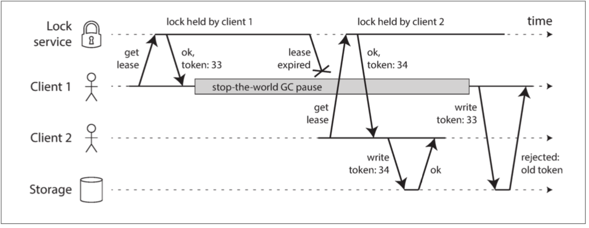

# CHAPTER 8: The Trouble with Distributed Systems

## 1 Faults and Partial Failures

### 1.1 Cloud Computing and Supercomputing

## 2 Unreliable Networks

_Figure 8-1. If you send a request and don’t get a response, it’s not possible to distinguish whether (a) the request was lost, (b) the remote node is down, or (c) the response was lost._

### 2.1 Network Faults in Practice

### 2.2 Detecting Faults

### 2.3 Timeouts and Unbounded Delays

_Figure 8-2. If several machines send network traffic to the same destination, its switch queue can fill up. Here, ports 1, 2, and 4 are all trying to send packets to port 3._

### 2.4 Synchronous Versus Asynchronous Networks

## 3 Unreliable Clocks

### 3.1 Monotonic Versus Time-of-Day Clocks

### 3.2 Clock Synchronization and Accuracy

### 3.3 Relying on Synchronized Clocks

_Figure 8-3. The write by client B is causally later than the write by client A, but B’s write has an earlier timestamp._

### 3.4 Process Pauses

## 4 Knowledge, Truth, and Lies

### 4.1 The Truth Is Defined by the Majority

_Figure 8-4. Incorrect implementation of a distributed lock: client 1 believes that it still has a valid lease, even though it has expired, and thus corrupts a file in storage._

_Figure 8-5. Making access to storage safe by allowing writes only in the order of increasing fencing tokens._

如果ZooKeeper被用作锁服务，事务ID zxid或节点版本cversion可以被用作围栏令牌。 由于它们被保证是单调增长的，所以它们具有所需的属性[74]。

### 4.2 Byzantine Faults

### 4.3 System Model and Reality

## Summary
