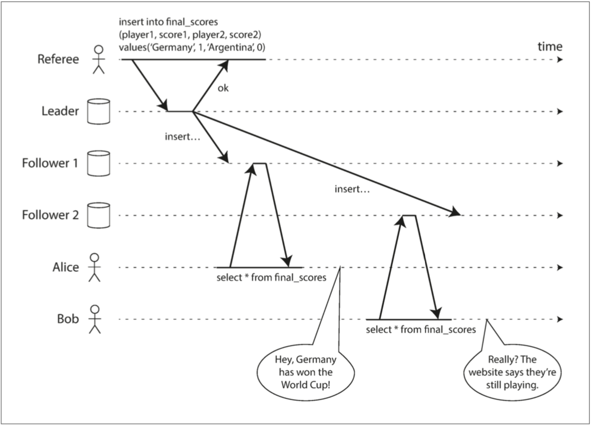
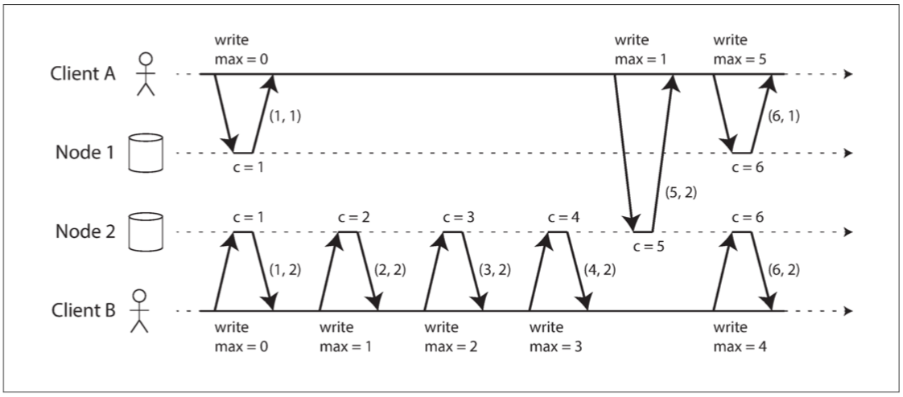

# CHAPTER 9: Consistency and Consensus

## 1 Consistency Guarantees

## 2 Linearizability

_linearizability_ [6] (also known as _atomic consistency_ [7], _strong consistency_, _immediate consistency_, or _external consistency_ [8])

_Figure 9-1. This system is not linearizable, causing football fans to be confused._

### 2.1 What Makes a System Linearizable?

_Figure 9-2. If a read request is concurrent with a write request, it may return either the old or the new value._

_Figure 9-3. After any one read has returned the new value, all following reads (on the same or other clients) must also return the new value._

_Figure 9-4. Visualizing the points in time at which the reads and writes appear to have taken effect. The final read by B is not linearizable._

### 2.2 Relying on Linearizability

#### 2.2.1 Locking and leader election

#### 2.2.2 Constraints and uniqueness guarantees

#### 2.2.3 Cross-channel timing dependencies

_Figure 9-5. The web server and image resizer communicate both through file storage and a message queue, opening the potential for race conditions._

### 2.3 Implementing Linearizable Systems

- _Single-leader replication (potentially linearizable)_
- _Consensus algorithms (linearizable)_
- _Multi-leader replication (not linearizable)_
- _Leaderless replication (probably not linearizable)_

#### 2.3.1 Linearizability and quorums

_Figure 9-6. A nonlinearizable execution, despite using a strict quorum._

### 2.4 The Cost of Linearizability

_Figure 9-7. A network interruption forcing a choice between linearizability and availability._

#### 2.4.1 The CAP theorem

#### 2.4.2 Linearizability and network delays

## 3 Ordering Guarantees

### 3.1 Ordering and Causality

#### 3.1.1 The causal order is not a total order

#### 3.1.2 Linearizability is stronger than causal consistency

#### 3.1.3 Capturing causal dependencies

### 3.2 Sequence Number Ordering

_sequence numbers_ or _timestamps_. _logical clock_

_total order_

_consistent with causality_

#### 3.2.1 Noncausal sequence number generators

#### 3.2.2 Lamport timestamps

_Lamport timestamp_

_Figure 9-8. Lamport timestamps provide a total ordering consistent with causality._

#### 3.2.3 Timestamp ordering is not sufficient

### 3.3 Total Order Broadcast

1. _Reliable delivery_
2. _Totally ordered delivery_

#### 3.3.1 Using total order broadcast

#### 3.3.2 Implementing linearizable storage using total order broadcast

### 3.3.3 Implementing total order broadcast using linearizable storage

## 4 Distributed Transactions and Consensus

- _Leader election_
- _Atomic commit_

### 4.1 Atomic Commit and Two-Phase Commit (2PC)

#### 4.1.1 From single-node to distributed atomic commit

#### 4.1.2 Introduction to two-phase commit

_XA transactions_

_Figure 9-9. A successful execution of two-phase commit (2PC)._

_coordinator_ (_transaction manager_)

#### 4.1.3 A system of promises

#### 4.1.4 Coordinator failure

_Figure 9-10. The coordinator crashes after participants vote “yes.” Database 1 does not know whether to commit or abort._

#### 4.1.5 Three-phase commit

### 4.2 Distributed Transactions in Practice

1. _Database-internal distributed transactions_
2. _Heterogeneous distributed transactions_

#### 4.2.1 Exactly-once message processing

#### 4.2.2 XA transactions

_X/Open XA (eXtended Architecture)_

#### 4.2.3 Holding locks while in doubt

#### 4.2.4 Recovering from coordinator failure

_heuristic decisions_. _probably breaking atomicity_

#### 4.2.5 Limitations of distributed transactions

### 4.3 Fault-Tolerant Consensus

- _Uniform agreement_
- _Integrity_
- _Validity_
- _Termination_

#### 4.3.1 Consensus algorithms and total order broadcast

#### 4.3.2 Single-leader replication and consensus

#### 4.3.3 Epoch numbering and quorums

_epoch number_ (called the _ballot number_ in Paxos, _view number_ in Viewstamped Replication, and _term number_ in Raft)

#### 4.3.4 Limitations of consensus

### 4.4 Membership and Coordination Services

ZooKeeper

- _Linearizable atomic operations_
- _Total ordering of operations_
- _Failure detection_
- _Change notifications_

#### 4.4.1 Allocating work to nodes

#### 4.4.2 Service discovery

ZooKeeper, etcd, Consul, _service discovery_

#### 4.4.3 Membership services

_membership services_

## Summary
