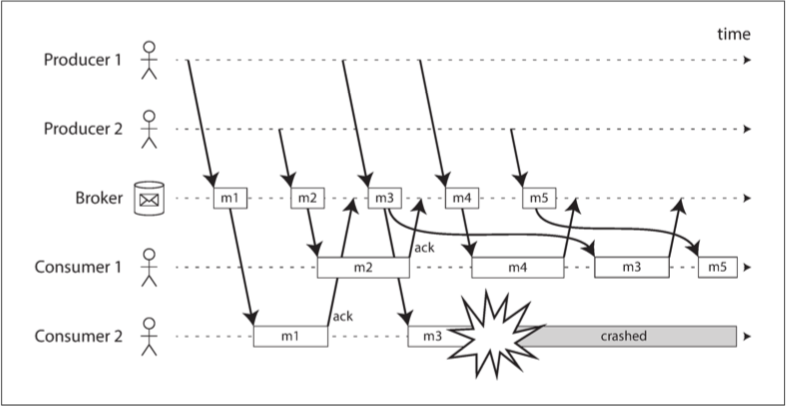
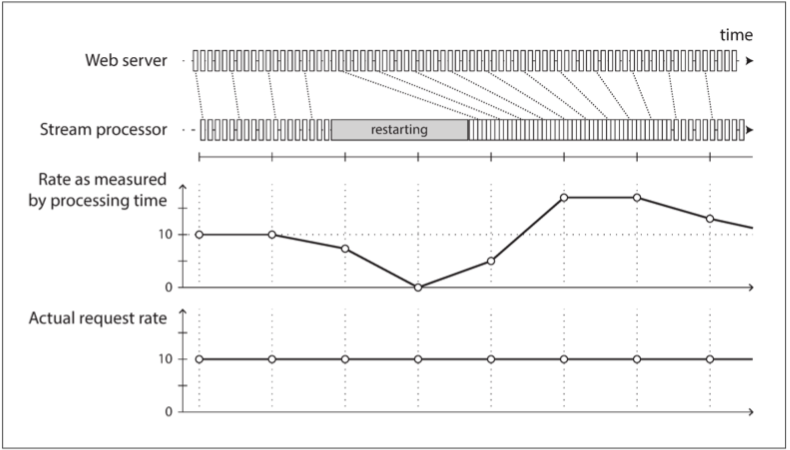

# CHAPTER 11: Stream Processing

## 1 Transmitting Event Streams

__P5__ 在流处理的术语中，一个事件由 *生产者*（*producer*）（*发布者*（*publisher*）/*发送者*（*sender*））产生一次，然后可能由多个 *消费者*（*consumer*）（*订阅者*（*subscriber*）/*接受者*（*recipient*））处理。在流处理系统中，相关的事件通常被分组为一个*主题*（*topic*）/*流*（*stream*）。

### 1.1 Messaging Systems

__P1__ _messaging system_

__P2__ 生产者和消费者之间建立直接通信渠道，如Unix管道/TCP连接，是实现消息传递系统的一种简单方式。但Unix管道和TCP连接一个发送者和一个接收者，而消息系统允许多个生产者节点向同一个主题发送消息，并允许多个消费者节点接收同一个主题中的消息。

__P3__ 
1. Q: *如果生产者发送信息的速度超过消费者处理信息的速度，会发生什么？* 
    A: 3 options:
    1. Drop messages
    2. Buffer messages in a queue (write messages to disk if the queue no longer fits in memory)
    3. _Backpressure_ (_flow control_), e.g., Unix pipes / TCP 
2. Q: *如果节点崩溃或暂时下线，会发生什么情况--是否会丢失信息？* 
    A: Durability 可能需要某些磁盘写入和/或 replication 的组合（[7.1.1.4 Durability]()），这是一种开销。如果你能接受有时丢失信息，你可能在同一硬件上获得更高的吞吐量和更低的延迟。

__P4__ 消息丢失是否可以接受，在很大程度上取决于应用。

#### 1.1.1 Direct messaging from producers to consumers

__P1__ 一些消息传递系统使用在生产者和消费者之间直接的网络通信，而不经过中间节点：
- UDP multicast (组播): 广泛应用于金融行业，如股票市场 feeds，低延迟很重要。UDP不可靠，应用层协议恢复丢失的数据包（生产者必须记住它所发送的数据包，以便按需重传）。
- Brokerless messaging libraries (无代理的消息库): ZeroMQ[^9], nanomsg 通过TCP或IP组播实现发布/订阅消息。
- StatsD[^10], Brubeck[^7]: 使用不可靠的UDP传递消息来收集网络上所有机器的指标并对其进行监控。
- 如果消费者在网络上公开一项服务，生产者就可以直接提出HTTP/RPC请求（[4.2.2 Dataflow Through Services: REST and RPC](https://github.com/Phi-Li/ddia/blob/notes/Chapter04.md#22-dataflow-through-services-rest-and-rpc)），将消息推送给消费者。 
    Webhooks: 一个服务的回调URL被注册到另一个服务中，每当有事件发生时，它就向该URL发出请求。

__P2__ 上述这些直接的消息传递系统通常要求应用的代码意识到消息丢失的可能性。它们的容错是相当有限的：即使协议检测并重传网络中丢失的数据包，它们一般也会假定生产者和消费者一直在线。

__P3__ 如果消费者处于离线状态，它可能会错过在它 unreachable 时发送的消息。一些协议允许生产者重试失败的消息传递，但如果生产者崩溃，失去了消息缓冲区中本应重传的消息，这种方法就可能無駄了。

#### 1.1.2 Message brokers

__P1__ _message broker_ (_message queue_), 它本质上是一种数据库，为处理消息流而优化[^13]。

__P3__ _asynchronous_: 当生产者发送消息后，它通常只会等待消息队列确认已经缓冲了该消息，而不会等待消息被消费者处理。

#### 1.1.3 Message brokers compared to databases

| Database | Message queue |
| -------- | ------------- |
| 长期的数据存储 | 自动删除消息 |
|          | 工作集很小 |
| 二级索引 & 各种搜索数据的方式 | 订阅匹配某些模式的 topics 的子集 |
| 结果通常基于某一时间点的快照； 先来的客户端不会发现之前的结果现在已经过时了（除非它重复查询，或轮询变更） | 不支持任意查询，但它们会在数据发生变更时（即，有新消息时）通知客户端 |

- Java Message Service (JMS)[^14]
- Advanced Message Queuing Protocol (AMQP)[^15]
- RabbitMQ, ActiveMQ, HornetQ, Qpid, TIBCO Enterprise Message Service, IBM MQ, Azure Service Bus
- Google Cloud Pub/Sub[^16]

#### 1.1.4 Multiple consumers

 
_Figure 11-1. (a) Load balancing: sharing the work of consuming a topic among consumers; (b) fan-out: delivering each message to multiple consumers._

- _Load balancing_ 
    - AMQP: 通过让多个客户端消费同一个队列的事件来实现;
    - JMS: _shared subscription_.
- _Fan-out_ 
    - JMS: topic subscriptions
    - AMQP: exchange bindings

__P2__ 两种模式结合：例如，两个独立的 consumer groups 可以订阅同一个主题，这样每个 group 都会收到所有的消息，但在每个 group 内每条消息仅由一个节点处理。

#### 1.1.5 Acknowledgments and redelivery

__P1__ _acknowledgment_: 消费者必须明确地告诉消息队列它何时完成了对一个消息的处理，这样消息队列就可以从队列中删除消息。

__P2__ (Note: 可能发生的一种情况是，消息已经处理完了，但确认却在网络中丢失。处理这种情况需要原子提交协议, [9.4.2 Distributed Transactions in Practice](https://github.com/Phi-Li/ddia/blob/notes/Chapter09.md#42-distributed-transactions-in-practice))

__P3__ 

 
_Figure 11-2. Consumer 2 crashes while processing m3, so it is redelivered to consumer 1 at a later time._

__P4__ 为了避免乱序的问题，你可以给每个消费者一个单独的队列 (i.e., not use the load balancing feature).

### 1.2 Partitioned Logs

__P5__ 将数据库的持久存储与消息传递的低延迟通知结合起来，这就是 _logbased message brokers_ 背后的想法。

#### 1.2.1 Using logs for message storage

__P3__ 为了提供比单个磁盘更高的吞吐量，可以对日志进行 _分区_ （Chapter 6）。不同的分区可以托管在不同的机器上，使每个分区成为独立的日志，可以独立于其他分区进行读写。一个 topic 可以定义为一组存储同一类型的消息的分区。Figure 11-3.

 
_Figure 11-3. Producers send messages by appending them to a topic-partition file, and consumers read these files sequentially._

__P4__ 在每个分区内， broker 为每个消息分配一个单调递增的序列号/ _offset_ （在图11-3中，方框内的数字是消息偏移量）。这样的序列号是有意义的，因为分区是仅追加的，所以一个分区内的消息是全序的。不同分区之间没有排序保证。

- Apache Kafka[^17]
- Amazon Kinesis Streams[^19]
- Twitter’s DistributedLog[^20]
- Google Cloud Pub/Sub[^16]: JMS-style API

__P5__ 尽管这些消息代理将所有消息写入磁盘，但通过分区到多台机器，它们能够实现每秒数百万条消息的吞吐量，并通过复制消息实现容错[^22][^23]。

#### 1.2.2 Logs compared to traditional messaging

__P1__ 
- _Fan-out_: 基于日志的方式天然支持扇出消息，因为读取一个消息不会从日志中删除它--几个消费者可以独立地读取日志而不影响彼此。
- _Load balancing_: 为了实现同组消费者之间的负载平衡，消息代理可以将整个分区分配给消费者组中的某一个节点。

__P2__ _Load balancing_: 然后，每个消费者都会消费它被指派的分区中的*所有*消息。通常情况下，当一个消费者被分配到一个日志分区时，它会以一种直截的单线程的方式按顺序读取该分区中的消息。 
Downsides:
- 分担消费同一个主题的消息的节点数量不能超过该主题中日志分区的数量，（一个分区只能有一个节点）。 ^i
- 如果某一条消息处理很慢，它就会耽误该分区后续消息的处理（head-of-line blocking 的一种形式； [1.3.2 Describing Performance](https://github.com/Phi-Li/ddia/blob/notes/Chapter01.md#32-describing-performance)）。

| JMS/AMQP style | Log-based |
| -------------- | --------- |
|                | 吞吐量大 |
| 每个消息的处理慢 | 每个消息的处理快 |
| 消息顺序不重要 | 消息顺序重要 |

i. 一个可能的负载平衡方案：两个消费者分担同一个分区的处理，但一个只处理具有偶数偏移量的消息，而另一个则处理奇数偏移量。你还可以将消息处理分散到一个线程池，但这种方法使消费者的偏移量管理更加复杂。 
一般来说，单线程处理一个分区是比较好的，并行性可以通过使用更多的分区来增加。

#### 1.2.3 Consumer offsets

__P1__ 顺序地消费一个分区能很容易地知道哪些消息已经被处理了：所有 offset 小于消费者 current offset 的消息都已经被处理了，所有 offset 大于后者的消息还没有被看到。 
因此，消息代理不需要跟踪每一个消息的确认，它只需要定期记录消费者的偏移量即可。由于减少了 bookkeeping overhead，并能 batching & pipelining，这种方法有助于提高基于日志的系统的吞吐量。

__P2__ (这里的偏移量实际上与 single-leader database replication 中常见的 *日志序列号* 非常相似，[1.1.2 Setting Up New Followers](https://github.com/Phi-Li/ddia/blob/notes/Chapter05.md#12-setting-up-new-followers)。这里使用了完全相同的原则：消息中介的行为像主库，而消费者像一个从库。)

__P3__ 如果一个消费者节点发生故障，同组的另一个节点会接管它的分区，并从它最后记录的偏移量开始消费消息。如果故障的消费者已经处理了之后的消息，但没来得及记录它们的偏移量，那么在故障的消费者重启后这些消息会被重复处理第二次。[11.3.4 Fault Tolerance]()

#### 1.2.4 Disk space usage

__P1__ 如果只追加日志，磁盘空间最终会耗尽。为了回收磁盘空间，日志实际上会被分段，并不时地删除旧的段或转移旧的段到归档存储。(See something later?)

__P2__ 这意味着，如果一个消费者跟不上消息产生的速率，落后太多，它的消费者偏移量指向一个已被删除的段，那么它就会错过一些消息。 
*循环缓冲区*(*circular buffer*)/*环形缓冲区*(*ring buffer*)：实际上，日志实现了一个大小有限的的缓冲区，当缓冲区满时会丢弃旧的消息。不过，由于该缓冲区是在磁盘上，它可能相当大。

__P3__ （接上）A back-of-the-envelope calculation: 在本书编写时，一个典型的大型硬盘的容量为6TB，顺序写入吞吐量为150MB/s。如果全速写入，需要大约11小时才能填满硬盘。因此，磁盘至少可以缓冲11小时内的消息，之后才开始覆盖旧的消息。 
现实中的部署很少会使用磁盘的全部写入带宽，所以日志通常可以保存几天甚至几周的消息缓存。

__P4__ 无论你保留消息多长时间，日志的吞吐量基本保持不变，因为无论如何，每条消息都会被写入磁盘。 
对比：默认将消息保存在内存中，仅当队列过长时才写入磁盘的消息传递系统，在队列较短时很快，而当它们开始写入磁盘时就要慢得多，所以吞吐量取决于要保留的历史的数量。

#### 1.2.5 When consumers cannot keep up with producers

__P2__ 监控：你可以监控一个消费者落后于日志头部的程度，如果它明显落后，就告警。由于缓冲区很大，所以有足够的时间让操作人员修复落后的消费者，让它在开始错过消息之前赶上。

__P3__ 即使一个消费者真的落后太多，开始错过消息，也只有这个消费者会受到影响；它不会破坏其他消费者的服务。当一个消费者被关闭/崩溃时，它会停止消耗资源--唯一剩下的只有它的消费者偏移量。 
A big operational advantage: 你可以为了开发、测试或调试的目的实验性地消费生产环境的日志，而不必担心破坏生产环境的服务。

__P4__ 对比：传统的消息中介需要小心地删除消费者已被关闭的队列--否则它们会继续不必要地累积消息，并挤占仍在活动的消费者的内存。

#### 1.2.6 Replaying old messages 重放旧的消息

| AMQP-/JMS-style | Log-based |
| --------------- | --------- |
| 处理和确认消息有破坏性，导致代理删除消息。 | 消费消息是只读操作，不会改变日志。 |

__P2__ 除消费者的输出外，处理的唯一副作用是消费者的偏移量向前移动。 
但偏移量在消费者的控制之下，操纵它很容易：例如，你可以用昨天的偏移量启动一个消费者副本，并将输出写到一个不同的位置，以便重新处理最近一天的消息。你可以用不同的处理代码重复任意次。

__P3__ 这一方面使得基于日志的消息传递更像上一章的批处理，衍生数据通过可重复的转换过程，与输入数据明确地区分。允许更多的实验，更容易从错误和bug中恢复，使其成为集成数据流的好工具[^24]。

(Conclusion: 磁盘，大容量，持久化，复制，无副作用 vs 内存，小容量，易失性，移动，有副作用)

## 2 Databases and Streams

__P1__ 从消息传递和流中汲取灵感，并应用于数据库。

__P3__ ([5.1.4 Implementation of Replication Logs](https://github.com/Phi-Li/ddia/blob/notes/Chapter05.md#14-implementation-of-replication-logs))

__P4__ [9.3.3 Total Order Broadcast](https://github.com/Phi-Li/ddia/blob/notes/Chapter09.md#33-total-order-broadcast)

__P5__ 从事件流搬运 ideas 到数据库。

### 2.1 Keeping Systems in Sync

__P1__ 例如：
- OLTP数据库 - 服务用户请求
- 缓存 - 加速常用请求
- 全文索引 - 处理搜索查询
- 数据仓库 - 分析
每个都有自己的数据副本，用为自己的目的而优化的表示方式去存储。

__P3__ _dual write_

__P4__ 
 
_Figure 11-4. In the database, X is first set to A and then to B, while at the search index the writes arrive in the opposite order._

__P5__ [5.4.4 Detecting Concurrent Writes](https://github.com/Phi-Li/ddia/blob/notes/Chapter05.md#44-detecting-concurrent-writes)

__P6__ 确保它们要么成功，要么失败，这是一个原子提交问题，解决这个问题的成本很高。 ([9.4.1 Atomic Commit and Two-Phase Commit (2PC)](https://github.com/Phi-Li/ddia/blob/notes/Chapter09.md#41-atomic-commit-and-two-phase-commit-2pc))

__P7__ ([5.3 Multi-Leader Replication](https://github.com/Phi-Li/ddia/blob/notes/Chapter05.md#3-multi-leader-replication))

### 2.2 Change Data Capture

__P3__ 最近，人们对 _change data capture_ (CDC) 越来越感兴趣。CDC是观察写入数据库的所有数据变更，并将其提取出来以复现到其他系统的过程。

__P4__ 
 
_Figure 11-5. Taking data in the order it was written to one database, and applying the changes to other systems in the same order._

#### 2.2.1 Implementing change data capture

__P2__ 从本质上讲，change data capture 使一个数据库成为领导者（changes are captured），其他数据库变为跟随者。基于日志的消息代理很适合从源数据库传输变更事件，因为它保留了消息的顺序（避免了图11-2中的重新排序问题）。

__P4__ 
- LinkedIn Databus
- Facebook Wormhole[^26]
- Yahoo! Sherpa[^27]
- Bottled Water, decodes PostgreSQL write-ahead log[^28]
- Maxwell, Debezium, parsing MySQL binlog[^31]
- Mongoriver, reads the MongoDB oplog[^32] [^33]
- GoldenGate, Oracle databases[^35]

__P5__ Asynchronous: record database 系统不会等到消费者们都应用变更后再提交。 
Operational advantage: 添加一个慢速消费者不会对 system of record 产生太大影响。 
Downside: ([5.2 Problems with Replication Lag](https://github.com/Phi-Li/ddia/blob/notes/Chapter05.md#2-problems-with-replication-lag))

#### 2.2.2 Initial snapshot

__P2__ [5.1.2 Setting Up New Followers](https://github.com/Phi-Li/ddia/blob/notes/Chapter05.md#12-setting-up-new-followers)

#### 2.2.3 Log compaction

__P1__ _log compaction_

__P3__ (在日志结构的存储引擎中，具有特殊空值（*tombstone* *墓碑*）的更新表示该键被删除，并会在日志压缩过程中被移除。 
如果同一个键经常被覆盖写入，旧的值最终会被垃圾回收，只有最新的值会被保留。)

__P4__ 如果CDC系统被设置成，每个变更都有一个主键，并且某一个键的每次更新都会替换该键的旧值，那么只保留某个键的最新写入就足够了。

__P6__ Apache Kafka 支持日志压缩。它允许消息代理用作持久性存储。

#### 2.2.4 API support for change streams

- RethinkDB[^36], notifications of changes of results of a query
- Firebase[^37], CouchDB[^38], data synchronization based on a change feed
- Meteor[^39], MongoDB oplog
- VoltDB 允许事务以流的形式连续导出数据库的数据[^40]。数据库将关系数据模型中的输出流表示为一个表，事务可以向这个表中插入 tuples，但这个表不能被查询。已提交的事务按照提交的顺序写到这个特殊的表，写入的 log of tuples 最终组成流。外部消费者可以异步地消费这个日志，并用它来更新派生数据系统。
- Kafka Connect[^41]

### 2.3 Event Sourcing

__P1__ _event sourcing_, domain-driven design (DDD) community [42, 43, 44].

__P5__ chronicle data model [45]

__P6__ Event Store[^46]

#### 2.3.1 Deriving current state from the event log

#### 2.3.2 Commands and events

__P1__ _events_ & _commands_ [48].

__P3__ 在事件生成的时刻，它就成为了事实（*fact*）。

### 2.4 State, Streams, and Immutability

__P4__ _changelog_

__P5__ 
 
_Figure 11-6. The relationship between the current application state and an event stream._

__P6__ 
> Transaction logs record all the changes made to the database. High-speed appends are the only way to change the log.
> From this perspective, the contents of the database hold a caching of the latest record values in the logs.
> The truth is the log.
> The database is a cache of a subset of the log. That cached subset happens to be the latest value of each record and index value from the log.

__P7__ 日志压缩（[11.2.2.3 Log compaction]()）是日志和数据库状态之间的桥梁：它只保留每条记录的最新版本，并丢弃被覆盖的版本。

#### 2.4.1 Advantages of immutable events

#### 2.4.2 Deriving several views from the same event log

__P1__ 
- Druid, an analytic database, ingests directly from Kafka[^55]
- Pistachio, a distributed key-value store, uses Kafka as a commit log
- Kafka Connect export data from Kafka to various different databases and indexes[^41]

__P3__ _Command query responsibility segregation_ (CQRS): 通过将数据的写入形式和读取形式分离，允许几种不同的读取视图，你能获得很大的灵活性。 
模式设计、索引和存储引擎的许多复杂性，都是希望支持某些特定的查询和访问模式的结果。

__P5__ [1.3.1 Describing Load](https://github.com/Phi-Li/ddia/blob/notes/Chapter01.md#31-describing-load) Twitter 的主页时间线，是一个特定用户所关注的人最近推文的缓存（就像一个邮箱）。A example of read-optimized state.

#### 2.4.3 Concurrency control

__P1__ Biggest downside - asynchronous: 用户可能会写日志，然后读取从日志派生的视图，结果发现他写的东西还没有反映在读取的视图中。 [5.2.1 Reading Your Own Writes](https://github.com/Phi-Li/ddia/blob/notes/Chapter05.md#21-reading-your-own-writes-读己之写)

__P2__ One solution: 在将事件追加到日志中的同时，同步执行读取视图的更新。 
事务：
- 在同一个存储系统中放置事件日志和读视图
- 分布式事务
Alternatively, [9.3.3.2 Implementing linearizable storage using total order broadcast](https://github.com/Phi-Li/ddia/blob/notes/Chapter09.md#332-implementing-linearizable-storage-using-total-order-broadcast)

__P4__ 如果事件日志和应用状态以同样的方式分区（例如，处理分区3中的客户的事件只需要更新应用状态的分区3），那么用一个直截的单线程日志消费者就够了，不需要写入并发控制 -- by construction, it only processes a single event at a time ([7.3.1 Actual Serial Execution](https://github.com/Phi-Li/ddia/blob/notes/Chapter07.md#31-actual-serial-execution)). 日志通过定义分区中事件的串行顺序，消除了并发的不确定性[^24]。

#### 2.4.4 Limitations of immutability

__P2__ Feasible?
- Workloads mostly add & rarely update or delete: Easy.
- Workloads have a high rate of updates & deletes on a comparatively small dataset:
    - Large
    - Fragmentation
    - Operational robustness: Performance of compaction and garbage collection

__P3__ Privacy regulations, data protection legislation, sensitive information

__P4__ 在这些情况下，你实际上是想改写历史，假装这些数据一开始就没有被写入。
- Datomic, _excision_[^62]
- Fossil, _shunning_[^63]

## 3 Processing Streams

__P2__ 
1. 你可以将事件中的数据写到数据库、缓存、搜索索引或类似的存储系统中，在那里数据能被其他 clients 查询。
2. 你能以某种方式将事件推送给用户，例如发送告警邮件或推送通知，或将事件流式传输到可将其可视化实时仪表板上。在这种情况下，人是流的最终消费者。
3. 你可以处理一个或多个输入流以产生一个或多个输出流。流可以经过由几个这样的处理阶段组成的流水线，最终在输出端结束（1 or 2）。

__P3__ Processing streams to produce other, derived streams. 
_operator_ _算子_ / _job_ _作业_: 一段处理这样的流的代码 
流处理器以只读的方式消费输入流，并以 append-only 的方式将其输出写到一个不同位置。

### 3.1 Uses of Stream Processing

__P1__ 长期以来，流处理一直被用于监控目的，organization 希望在某些事件发生时得到警报。

#### 3.1.1 Complex event processing

__P1__ _Complex event processing_ (CEP)

__P2__ 这些查询被提交给一个处理引擎，该引擎消费输入流，并在内部维护一个状态机，执行所需的匹配。当找到一个匹配时，引擎会发出一个 *complex event* （CEP因此而得名），其中包含检测到的事件模式的细节[67]。

__P4__ 
- Esper
- IBM InfoSphere Streams
- Apama, TIBCO StreamBase, SQLstream
- Samza[^71]

#### 3.1.2 Stream analytics

__P2__ _Window_: Time interval over which you aggregate.

__P3__ Probabilistic algorithms:
- Bloom filters ([3.1.2.3 Performance optimizations](https://github.com/Phi-Li/ddia/blob/notes/Chapter03.md#123-performance-optimizations)): set membership
- HyperLogLog[^72]: cardinality estimation
- Various percentile estimation algorithms

__P4__ Open source distributed stream processing frameworks:
- Apache Storm
- Spark Streaming
- Flink
- Concord
- Samza
- Kafka Streams
Hosted services:
- Google Cloud Dataflow
- Azure Stream Analytics

#### 3.1.3 Maintaining materialized views

__P1__ ([3.3.4 Aggregation: Data Cubes and Materialized Views](https://github.com/Phi-Li/ddia/blob/notes/Chapter03.md#34-aggregation-data-cubes-and-materialized-views))

__P3__ Samza & Kafka Streams 支持这种用法，底层依赖 Kafka 对日志压缩的支持[^75]。

#### 3.1.4 Search on streams

__P2__  
Elasticsearch[^76], percolator, implementing stream search

__P3__ 
| Conventional search engines | Stream search |
| --------------------------- | ------------- |
| run queries over document index  | documents run past queries |
为了优化这一过程，可以 index the queries as well as the documents，从而缩小可能匹配的查询的集合[77]。

#### 3.1.5 Message passing and RPC

__P1__ 
| Actor model | Stream processing |
| ----------- | ----------------- |

__P2__  
Apache Storm, _distributed RPC_, 它允许 user queries 被分散到一组 that also process event streams 的节点上；然后这些查询与输入流中的事件 interleave，结果可以被汇总并发回给用户[78]（[12.2.3.6 Multi-partition data processing]()）。

### 3.2 Reasoning About Time

#### 3.2.1 Event time versus processing time

__P4__ 混淆事件时间和处理时间会产生错误的数据。例如，假设你有一个统计每秒请求数量的流处理器。如果你要重新部署它，它可能会停止一分钟，并在重启后处理期间积压的事件。如果你按处理时间来衡量速率，就会看起来像是在处理积压事件期间突然出现了异常的请求高峰，而实际的请求速率是稳定的（图11-7）。

 
_Figure 11-7. Windowing by processing time introduces artifacts due to variations in processing rate._

#### 3.2.2 Knowing when you’re ready

#### 3.2.3 Whose clock are you using, anyway?

__P3__ 
<table>
  <tbody>
    <tr><td>发生时间</td><td rowspan="2">设备时钟</td></tr>
    <tr><td>发送时间</td></tr>
    <tr><td>接收时间</td><td>服务器时钟</td></tr>
  </tbody>
</table>

#### 3.2.4 Types of windows

- _Tumbling window_
- _Hopping window_
- _Sliding window_
- _Session window_

### 3.3 Stream Joins

#### 3.3.1 Stream-stream join (window join)

#### 3.3.2 Stream-table join (stream enrichment)

#### 3.3.3 Table-table join (materialized view maintenance)

#### 3.3.4 Time-dependence of joins

__P6__ _slowly changing dimension_ (SCD)

### 3.4 Fault Tolerance

__P2__ _exactly-once semantics_ _恰好一次语义_ / _effectively-once_ _等效一次_

#### 3.4.1 Microbatching and checkpointing

__P1__ _Microbatching_ _微批次_: Spark Streaming[^91], 将流分成小块，并将每个块作为一个微型的批处理过程来处理。Batch size 通常约为1秒：
- 较小的批次：较大的调度&协调开销
- 较大的批次：在流处理器的结果显现之前会有较长的延迟。

__P2__ （接上） Microbatching 还隐含地提供了一个与 batch size 相等的滚动窗口（按处理时间分窗，而不是事件时间戳）；任何需要更大窗口的作业都需要显式地将状态从上一个 microbatch carry over 到下一个 microbatch。

__P3__ Checkpoint: Apache Flink 定期生成状态的滚动检查点，并将其写入持久存储中[^93]。如果一个流算子崩溃了，它可以从最近的检查点重新开始，并丢弃从最近的检查点到崩溃之间产生的所有输出。检查点是由消息流中的 barriers 触发的，类似于 microbatches 之间的边界，但没有强制规定一个特定的窗口大小。

__P4__ External side effect: （写数据库、向外部消息代理发送消息、发邮件）。在这种情况下，重启一个失败的任务会导致外部副作用发生两次。

#### 3.4.2 Atomic commit revisited

(Exactly-once solution 1)

__P1__ *当且仅当* 一个事件处理成功时，所有输出和副作用才会生效。
- 向下游算子/外部消息系统发送的消息（电子邮件/推送通知）
- 数据库写入
- 对算子状态的改变
- 对输入消息的确认（在基于日志的消息代理中向前移动消费者偏移量）

__P2__ [9.4.2.1 Exactly-once message processing](https://github.com/Phi-Li/ddia/blob/notes/Chapter09.md#421-exactly-once-message-processing)

__P3__ 这些实现通过在流处理框架内同时管理状态变化&消息传递来 keep transactions internal。事务协议的开销可以通过在单个事务中处理多个输入消息来分摊。
- Google Cloud Dataflow[^81]
- VoltDB[^94]
- Apache Kafka[^96]

#### 3.4.3 Idempotence

(Exactly-once solution 2)

__P1__ _idempotence_ _幂等性_

__P2__ EXAMPLE:
- 幂等：将键值存储中的某个键设置为某个固定的值 
    （再次写入该值，只是用同样的值覆盖该值）
- 不幂等：递增一个计数器 
    （再次执行，该值递增了两次）

__P3__ EXAMPLE: 在从 Kafka 消费消息时，每个消息都有一个持久化的、单调递增的偏移量。你可以在写一个值到外部数据库时，带上触发本次写的消息的偏移量。这样你就可以知道一个更新是否已经被应用，避免再次执行重复的更新。

__P4__ Storm Trident 
重启一个失败的任务必须以相同的顺序重放相同的消息（基于日志的消息代理能这样做），处理必须是确定性的，并且没有其他节点能同时更新相同的值[98, 99]。

__P5__ 当从一个处理节点 fail over 到另一个处理节点时，可能需要设置 fencing（[8.4.1.1 The leader and the lock]()），以防止 that is thought to be dead but is actually alive 的节点的干扰。

#### 3.4.4 Rebuilding state after a failure

__P2__:
1. 将状态保存在一个远程数据存储中，并进行复制。为每个单独的消息查询远程数据库会很慢，[11.3.3.2 Stream-table join (stream enrichment)]()。
2. 在本地定期复制流处理器的状态。然后，当流处理器从故障中恢复时，新的任务可以读取复制的状态并恢复处理，而不会丢失数据。

__P3__ EXAMPLE:
- Flink 定期捕获算子状态的快照，并将其写入HDFS等持久性存储中[^93]
- Samza & Kafka Streams 通过将状态变化发送到具有日志压缩功能的专用 Kafka 主题来复制状态变化，类似于 change data capture [^84] [^100]
- VoltDB 通过在多个节点上冗余地处理每个输入消息来复制状态（[7.3.1 Actual Serial Execution](https://github.com/Phi-Li/ddia/blob/notes/Chapter07.md#31-actual-serial-execution)）

__P4__ 在某些情况下，可能甚至没有必要复制状态，因为它可以从输入流重建。例如，如果状态由一个相当短的窗口上的 aggregations 构成，那么简单地重放该窗口对应的输入事件可能会很快。如果状态是一个通过 change data capture 维护的数据库的本地副本，那么这个数据库也可以从日志压缩的变更流中重建（[11.2.2.3 Log compaction]()）。

__P5__ Trade-off: 在一些系统中，网络延迟可能低于磁盘访问延迟，而网络带宽可能与磁盘带宽相当。不存在针对所有情况的普适的理想的权衡。

[^7]: [7] [Brubeck, a statsd-compatible metrics aggregator | The GitHub Blog](https://github.blog/2015-06-15-brubeck/)
[^9]: [9] [Introduction | ØMQ - The Guide](https://zguide.zeromq.org/)
[^10]: [10] [Measure Anything, Measure Everything - Code as Craft](https://codeascraft.com/2011/02/15/measure-anything-measure-everything/)
[^13]: [13] [Queues Are Databases - Microsoft Research](https://www.microsoft.com/en-us/research/publication/queues-are-databases/)
[^14]: [14] [The Java Community Process(SM) Program - JSRs: Java Specification Requests - detail JSR# 343](https://jcp.org/en/jsr/detail?id=343)
[^15]: [15] [Advanced Message Queuing Protocol Specification](https://www.rabbitmq.com/resources/specs/amqp0-9-1.pdf)
[^16]: [16] [Pub/Sub: A Google-Scale Messaging Service | Google Cloud](https://cloud.google.com/pubsub/architecture)
[^17]: [17] [Apache Kafka](https://kafka.apache.org/documentation.html)
[^19]: [19] [Amazon Kinesis Data Streams](https://docs.aws.amazon.com/streams/latest/dev/introduction.html)
[^20]: [20] [Building DistributedLog: High-performance replicated log service](https://blog.twitter.com/engineering/en_us/topics/infrastructure/2015/building-distributedlog-twitter-s-high-performance-replicated-log-servic)
[^22]: [22] [Benchmarking Apache Kafka: 2 Million Writes Per Second (On Three Cheap Machines) | LinkedIn Engineering](https://engineering.linkedin.com/kafka/benchmarking-apache-kafka-2-million-writes-second-three-cheap-machines)
[^23]: [23] [How We’re Improving and Advancing Kafka at LinkedIn | LinkedIn Engineering](https://engineering.linkedin.com/apache-kafka/how-we_re-improving-and-advancing-kafka-linkedin)
[^24]: [24] [The Log: What every software engineer should know about real-time data's unifying abstraction | LinkedIn Engineering](https://engineering.linkedin.com/distributed-systems/log-what-every-software-engineer-should-know-about-real-time-datas-unifying)
[^26]: [26] [Wormhole: Reliable Pub-Sub to Support Geo-replicated Internet Services](https://www.usenix.org/system/files/conference/nsdi15/nsdi15-paper-sharma.pdf)
[^27]: [27] [Sherpa update | ydnsevenblog - Yahoo](http://web.archive.org/web/20160801221400/https://developer.yahoo.com/blogs/ydn/sherpa-7992.html)
[^28]: [28] [Bottled Water: Real-time integration of PostgreSQL and Kafka — Martin Kleppmann’s blog](https://martin.kleppmann.com/2015/04/23/bottled-water-real-time-postgresql-kafka.html)
[^31]: [31] [Streaming MySQL tables in real-time to Kafka](https://engineeringblog.yelp.com/2016/08/streaming-mysql-tables-in-real-time-to-kafka.html)
[^32]: [32] [GitHub - stripe-archive/mongoriver: A library for writing MongoDB oplog tailers.](https://github.com/stripe-archive/mongoriver)
[^33]: [33] [Change data capture with MongoDB and Kafka.](https://www.slideshare.net/danharvey/change-data-capture-with-mongodb-and-kafka)
[^35]: [35] [Oracle GoldenGate Fundamentals: How Oracle GoldenGate Works - YouTube](https://www.youtube.com/watch?v=6H9NibIiPQE)
[^36]: [36] [Advancing the realtime web - RethinkDB](https://rethinkdb.com/blog/realtime-web/)
[^37]: [37] [Firebase Realtime Database  |  Firebase Documentation](https://firebase.google.com/docs/database/)
[^38]: [38] [Overview — Apache CouchDB® Documentation](https://docs.couchdb.org/en/latest/)
[^39]: [39] [Meteor 0.7.0: Scalable database queries using MongoDB oplog instead of poll-and-diff | by Matt DeBergalis | Meteor Blog](https://blog.meteor.com/meteor-0-7-0-scalable-database-queries-using-mongodb-oplog-instead-of-poll-and-diff-7c4166441ab8)
[^40]: [40] [Chapter 15. Streaming Data: Import, Export, and Migration](https://docs.voltdb.com/UsingVoltDB/ChapExport.php)
[^41]: [41] [Announcing Kafka Connect: Building large-scale low-latency data pipelines | Confluent](https://www.confluent.io/blog/announcing-kafka-connect-building-large-scale-low-latency-data-pipelines/)
[^46]: [46] [EventStoreDB Documentation](https://developers.eventstore.com/)
[^55]: [55] [Dogfooding with Druid, Samza, and Kafka: Metametrics at Metamarkets | Metamarkets](https://metamarkets.com/2015/dogfooding-with-druid-samza-and-kafka-metametrics-at-metamarkets/)
[^62]: [62] [Excision | Datomic](https://docs.datomic.com/on-prem/reference/excision.html)
[^63]: [63] [Fossil: Deleting Content From Fossil](https://fossil-scm.org/home/doc/trunk/www/shunning.wiki)
[^71]: [71] [SamzaSQL: Scalable Fast Data Management with Streaming SQL](https://github.com/milinda/samzasql-hpbdc2016/blob/master/samzasql-hpbdc2016.pdf)
[^75]: [75] [Why local state is a fundamental primitive in stream processing – O’Reilly](https://www.oreilly.com/content/why-local-state-is-a-fundamental-primitive-in-stream-processing/)
[^76]: [76] [Percolator | Elastic Blog](https://www.elastic.co/blog/percolator)
[^81]: [81] [MillWheel: Fault-Tolerant Stream Processing at Internet Scale – Google Research](https://research.google/pubs/pub41378/)
[^84]: [84] [Samza - State Management](http://samza.apache.org/learn/documentation/0.10/container/state-management.html)
[^91]: [91] [Discretized Streams: An Efficient and Fault-Tolerant Model for Stream Processing on Large Clusters](https://www.usenix.org/system/files/conference/hotcloud12/hotcloud12-final28.pdf)
[^93]: [93] [Lightweight Asynchronous Snapshots for Distributed Dataflows](https://arxiv.org/abs/1506.08603)
[^94]: [94] [Fast Data: Smart and at Scale [Book]](https://www.oreilly.com/library/view/fast-data-smart/9781492048381/)
[^96]: [96] [KIP-98 - Exactly Once Delivery and Transactional Messaging - Apache Kafka - Apache Software Foundation](https://cwiki.apache.org/confluence/display/KAFKA/KIP-98+-+Exactly+Once+Delivery+and+Transactional+Messaging)
[^100]: [100] [Kafka Streams - how does it fit the stream processing landscape?](https://softwaremill.com/kafka-streams-how-does-it-fit-stream-landscape/)
